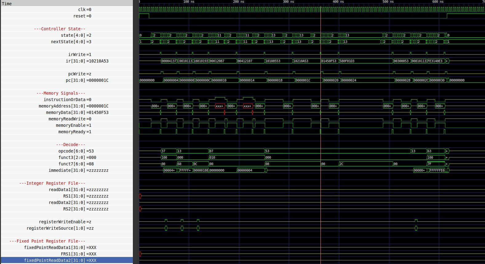

Computer Organization - Spring 2024
==============================================================
## Iran Univeristy of Science and Technology
## final project

- Name:ashkan ghaseminezhad
- Team Members:pooria masoomi 400414084
- Student ID: 400414093
- Date:

## Report

### Description of Verilog Hardware Code
Multiplication and Square Root of Fixed Point Numbers
LUMOS Control Unit and Data Paths File

#### File: Fixed_Point_Unit.v
All parameters are completely and orderly defined in this code:
- **Parameter `WIDTH`** represents the total length of numbers (the processor is 32-bit).
- **Parameter `FBITS`** indicates that 10 bits are the fractional part, and the remaining bits are the integer part.
- **Clock** and **reset** (resets all values in flip-flops) are our inputs and outputs.
- We have two inputs named `operand_1` and `operand_2`.
- We have a 2-bit `operation`.
- There is a 32-bit `result` and a `ready` signal.

The `lumos` module takes two inputs `operand_1` and `operand_2` and waits until `ready` is set to one. When `ready` becomes one, the calculations are complete. After that, there is an `always` block sensitive to the rising edge of `reset` that determines if `reset` is one, `ready` becomes zero, and otherwise, `ready` is in high impedance state.

### Calculation Circuit for Addition, Subtraction, Multiplication, and Square Root:
The `always` block is a combinational circuit sensitive to the asterisk (meaning it is a multiplexer) that, based on the value of `operation` (whatever it is), adds `operand_1` and `operand_2` and places the result in `result`, then immediately sets `ready` to one. If `fpu` is set to `sub` (which means subtraction), `operand_1` is subtracted by `operand_2`, and `ready` is set to one. For square root (`sqrt`), if `fpu` is set to `mul`, a variable named `product` is placed in `result`, and `ready` is not directly set to one; instead, a signal called `product_ready` is used, thus controlling `ready` indirectly.

The multiplication operation takes five clock cycles to complete; at that time, `product_ready` can be set to one, making `ready` equal to one. For `fpu` sqrt, the value of `root` is placed in `result`, and `root_ready` is placed in `ready`, following the same logic as described above. If none of these conditions are met, `result` is set to high impedance, and `ready` becomes zero.

#### In the FPU `mul` section:
We place `product[WIDTH+FBITS-1:FBITS]` in `result`. The reason for this is as follows:
When we multiply two `n`-bit numbers, the result is a maximum of 2n bits. Thus, the signal `register product` is set to 64 bits (operands are 32-bit). However, the final output of this module is 32 bits. Therefore, we must select 32 bits from the 64 bits obtained, meaning the result is approximate due to the processor's bit limit.

But why the mentioned values? `WIDTH` is the total length of the number (32 bits), and `FBITS` are the 10 least significant bits. According to the governing mathematics, if we multiply two numbers each with a 10-bit fractional part, the result is 44 bits of the integer part and 20 bits of the fractional part. Now we want to select 32 bits from this obtained value, and we precisely choose the middle of the resulting value. Note that from position 0 to 19 are fractional bits, and from 20 to 63 are integer bits. Therefore, we consider bit 20 as the reference point and take 10 bits to the right and 22 bits to the left, giving us exactly what is described above and applied in the code: `32+10 to 10`, meaning from position 10 to 41, and the final result is placed in `result`.

### Multiplication Circuit:
Our computation method is through a state machine. A set of states are defined that are not changeable from outside. An `initial` block is provided for initial value assignment, setting all values in `product` initially to zero. We also have other defined registers such as `multiplierCircuitInput1`, `multiplierCircuitInput2`, and `partialProduct1` to `partialProduct4`, which are also initialized to zero. At the start, `multiplierState` is set to `idle`. An `always` block is sensitive to the asterisk (combinational circuit), and another block is sensitive to the clock edge, to follow the process:

In the clock-sensitive `always` block, `nextState` is assigned to `state` on each clock, and `ready` is set to zero by default because we want `ready` to be one only for one clock cycle when the result is ready. A `case` statement based on `multiplierState` exists here:

An `if` statement determines if `operation` is `fpumul` and `multiplierBusy` is zero because we don't know when the multiplication command is issued. After the command is completed, the `operation` remains `fpumul`, and we don't want it to keep executing repeatedly during this period. We want it to execute only when the command is given and then stop until the next command is issued. Therefore, we set `busy` to one because if `busy` is one, this `if` won't trigger again, preventing us from entering a loop and staying in `state1`. So after the first entry, we set `busy` to one, and this condition won't hold in subsequent checks.

There is also a line saying whenever a `reset` occurs, set all these variables to zero, revert to the initial state, and discard all previous computations.

Back in the `always` block sensitive to the asterisk, `nextState` is assigned to `state`, and all signals must have initial values because they are combinational circuits, and without them, our code might suffer from latch formation, which is not desirable.

Now, let's examine the `case` statements to see what states are present:

In the first state, we want to give an operand to the multiplier and place the output in the defined `products`. The process is clear and specified in the code.

### Square Root Circuit:
The logic here is similar to the previous sections. Some new variables are introduced in this section, initialized to zero using the `initial` block. There is an `always` block representing our circuit and another block sensitive to the clock edge. As before, `nextState` is assigned to `state`, and `ready` is always zero by default. A `case` statement performs a specific action based on the `operation`, as brought in the code.

In the `always` block with the asterisk, all assigned variables are set to zero, and a `case` statement based on `rootCalcState` keeps it in `idle`. We want to find the most significant bit and see its value. The number is divided into pairs of bits, and for numbers with an odd number of bits, one bit is appended to the back to make them pairable.

In the first state of the `always` block sensitive to the asterisk, we want to determine the value of the most significant bit to construct a counter based on it. In `rootCalc1`, we OR `operand1` with 32 bits of zero. The reason for choosing the number 32 is that we don't know the bit-length of the given number.

A `for` loop with counter `rootCalcI` from zero to `WIDTH` minus one is then placed. The value `i+1` is assigned to a variable named `rootCalcNumber`. For example, for the number ten, the most significant bit is zero, and since bits start from zero, it proceeds to the next bit. The result of all these operations is to find the significant bit count. Finally, the number is placed in `rootCalcOperand1` and stored in a flip-flop.

 
this text is translated by gpt-4 from persian to english . so we r sorry if there are any mistakes

the pictures of above:

and the final result and waveform:

the other part of codes and results are available .

hope you enjoy!

